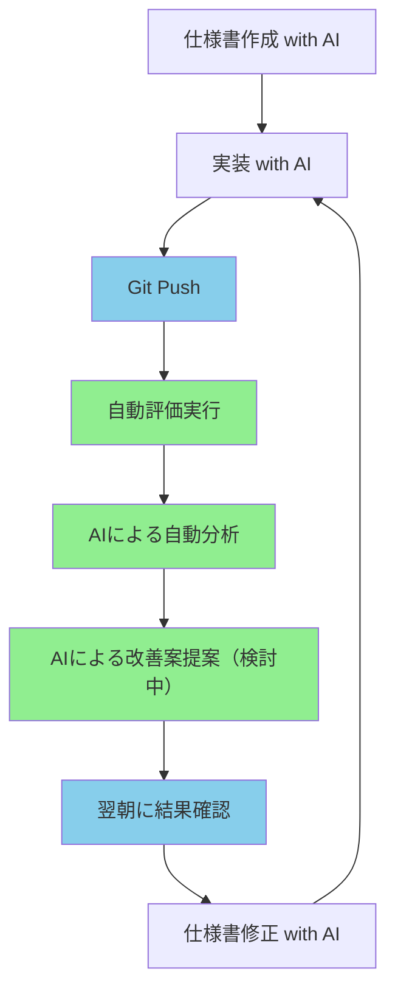

# アルゴリズム開発効率化プロジェクト

## 📋 プロジェクト概要

AI技術を活用してアルゴリズム開発プロセスを自動化・効率化し、開発時間の短縮と品質向上を実現するシステムです。

### 🎯 目的
- アルゴリズム開発の自動化（評価・分析・改善提案）
- 開発者の分析時間を削減
- 改善サイクルを短縮
- 課題管理時間を削減

### 🔄 自動化フロー


## 🚀 主な機能

### 🤖 AI自動分析
- **評価結果の自動分析**: Jupyter Notebook形式で出力
- **課題の自動抽出**: 性能問題の自動特定
- **改善案の自動提案（検討中）**: 具体的な改善策の提示

### 📊 継続的評価
- **自動評価実行**: コードPush時に自動実行
- **性能比較**: 修正前後の自動比較
- **可視化**: 分析結果の分かりやすい表示

### 🎯 課題管理（検討中）
- **自動課題生成**: AI分析結果から課題を自動生成
- **優先度判断**: 人間による優先度設定
- **効果測定**: 修正効果の自動測定

## 🏗️ システム構成

### 技術スタック
- **バックエンド**: Python 3.8+
- **AI分析**: OpenAI API
- **CI/CD**: GitHub Actions
- **データ処理**: MediaPipe, OpenCV, pandas
- **可視化**: Jupyter Notebook, matplotlib, seaborn
- **コンテナ**: Docker

### ディレクトリ構造
```
Improve_algorithm_development/
├── projects/                          # プロジェクト関連
│   ├── 01_データセット作成/           # 評価データセット
│   ├── 02_仕様書テンプレート/         # アルゴリズム仕様書
│   ├── 03_実装ルール/                 # コーディング規約
│   ├── 04_評価ツール/                 # 評価フレームワーク
│   ├── 05_検証実験/                   # 検証実験
│   └── 詳細設計資料/                  # システム設計書
├── external/                          # Git submodules
├── config/                           # 設定ファイル
├── utils/                            # ユーティリティ
└── Personal_Data/                    # 個人情報（別フォルダ）
```

## 📦 インストール

### 前提条件
- Python 3.8以上
- Git
- Docker（オプション）

### セットアップ手順

1. **リポジトリのクローン**
```bash
git clone https://github.com/your-org/Improve_algorithm_development.git
cd Improve_algorithm_development
```

2. **依存関係のインストール**
```bash
pip install -r requirements.txt
```

3. **環境変数の設定**
```bash
cp .env.example .env
# .envファイルを編集してAPIキー等を設定
```

4. **Git submodulesの初期化**
```bash
git submodule update --init --recursive
```

## 🎯 サンプルプロジェクト：閉眼検出アルゴリズム

### 概要
- **目的**: 動画から閉眼状態を検出するアルゴリズムの開発効率化
- **データ**: 4人×5回のタスク動画（3秒閉眼×2秒開眼）
- **評価指標**: Precision, Recall, F1-score

### データフロー


## 🔧 使用方法

### 1. アルゴリズム実装
```bash
# 仕様書テンプレートを使用
cp projects/02_仕様書テンプレート/algorithm_template.md my_algorithm_spec.md

# 実装ルールに従ってコーディング
# projects/03_実装ルール/coding_standards.md を参照
```

### 2. 評価実行
```bash
# 自動評価（CI/CD経由）
git add .
git commit -m "feat: アルゴリズム実装"
git push

# 手動評価
python projects/04_評価ツール/evaluation_tool.py
```

### 3. 結果確認
- **AI分析レポート**: `DB/05_analysis_output/{analysis_id}/`
- **改善提案**: （検討中）
- **課題管理**: （検討中）

## 📊 期待される効果

| 項目 | 現在 | 提案後 | 改善率 |
|------|------|--------|--------|
| 分析時間 | 5-8時間/回 | 1時間（半自動化） | **80%削減** |
| 効果測定時間 | 2-3時間/回 | 0時間（自動化） | **100%削減** |
| 開発者工数 | 高スキル必須 | 初級者でも可能 | **スキル依存度削減** |


## 🔍 詳細設計資料

- **[AI分析エンジン設計書](projects/詳細設計資料/AI分析エンジン設計書.md)**
- **[課題管理システム設計書](projects/詳細設計資料/課題管理システム設計書.md)**
- **[CI/CDパイプライン設計書](projects/詳細設計資料/CI_CDパイプライン設計書.md)**
- **[システムシーケンス図](projects/詳細設計資料/システムシーケンス図.md)**


## 📝 ライセンス

未定。


## 📝 メモ

このプロジェクトは以下の技術・サービスを活用しています：
- OpenAI API
- GitHub Actions
- MediaPipe / OpenCV

---

**最終更新**: 2025-10-21  
**バージョン**: 2.0  
**作成者**: アルゴリズム開発効率化プロジェクトチーム 

