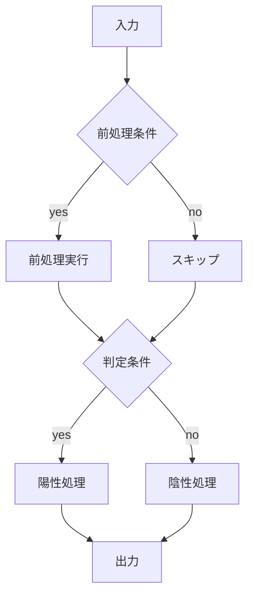

# アルゴリズム仕様書テンプレート (template_algorithm_specification)

## 1. 概要・目的

### 1.1 アルゴリズム名
- アルゴリズムの正式名称を記載
- 略称（任意）
- バージョン（SemVer 準拠を推奨: MAJOR.MINOR.PATCH）

### 1.2 目的・背景
- 解決したい課題・ユースケースの要約
- アルゴリズム導入の背景（既存手法の課題、期待効果など）
- 成功指標（KPI）や評価観点（例: 精度、速度、消費資源）

### 1.3 適用範囲
- 入力データの前提（取得元、更新頻度、品質）
- 対象プラットフォーム（例: Python 実装基準、C++ へ移植可 など）
- ハードウェア前提（CPU/GPU、リアルタイム要件、最大 fps など）

---

## 2. 技術仕様

### 2.1 入力仕様
- 入力フィールド、型、意味、制約を表で明示
- 欠損値や異常値の扱い方針（後述のエラーハンドリングと整合）

| フィールド | 型 | 説明 | 制約 |
| --- | --- | --- | --- |
| example_field | int/float/str | 意味を記載 | 範囲・形式・単調性など |

- 必須/任意の項目を明示
- 入力例（JSON 推奨）を提示

```json
{
  "field_a": 123,
  "field_b": 0.42,
  "field_c": "example"
}
```

### 2.2 出力仕様
- 出力フィールド、型、意味を表で明示
- エラーや不確実性の表現方法（コード/ステータス）

| フィールド | 型 | 説明 |
| --- | --- | --- |
| result_code | int | 判定結果（例: 正常=0、陽性=1、エラー=-1 など） |

- 出力例を提示

```json
{
  "result_code": 1
}
```

### 2.3 パラメータ
- 調整可能なハイパーパラメータを網羅
- デフォルト、許容範囲、意味を表で明示
- デフォルト値は根拠（データ分布/検証結果）と併記できると望ましい

| パラメータ | 説明 | デフォルト値 | 下限 | 上限 |
| --- | --- | --- | --- | --- |
| config_field_x | 判定に用いる閾値 | 0.5 | 0.0 | 1.0 |

---

## 3. アルゴリズム詳細

### 3.1 アルゴリズムの概要
- モジュール構成（前処理/判定/後処理 など）
- 各モジュールの役割を箇条書きで記載

1. 前処理モジュール: 例外値除去、正規化、平滑化
2. 判定モジュール: 主要な意思決定ロジック
3. 後処理モジュール: ヒステリシス、タイマ、状態遷移など

### 3.2 処理フロー
- Mermaid 記法などで処理フローを可視化
- 条件分岐とループ/状態遷移を明確化



### 3.3 擬似コード
- コア判定の擬似コードを簡潔に提示
- 時間/状態管理（必要に応じて）を明示

```python
# 入力検証
if not is_valid(input_data):
    reset_state()
    return {"result_code": -1}

# 前処理
processed = preprocess(input_data)

# 判定
is_positive = decision_rule(processed, threshold_x)

# 出力
return {"result_code": 1 if is_positive else 0}
```

### 3.4 エラーハンドリング
- 無効データ（NaN/範囲外/低信頼度）の扱い
- 例外時のログ出力と復帰戦略
- ステータスコードの定義（unknown, error, degraded など）

---

## 4. 実装仕様

### 4.1 開発環境
- 言語/ランタイム（例: Python 3.11）
- 主要ライブラリと役割（例: numpy, opencv, pydantic など）
- 移植方針（C++ などのターゲットと代替ライブラリ）

### 4.2 ファイル構成（例）
```
source/
  ├── detectors/
  │     └── detector_x.py      # サブモジュール
  ├── algorithm.py             # 本体実装
  ├── config.py                # パラメータ定義
  ├── tests/
  │     └── test_algorithm.py  # 単体テスト
  └── cli.py                   # CLI エントリ
```

### 4.3 ログ/監視
- ログレベル、キーイベント、メトリクス（遅延/スループット/エラー率）
- デバッグ用フラグやトレース出力の方針

---

## 5. テスト仕様

### 5.1 単体テスト
- 境界値/異常値/代表値のテストケース
- モジュールごとの独立検証（前処理・判定・後処理）

### 5.2 統合テスト
- 代表的な入力系列（動画/センサ時系列など）での再生試験
- 誤検知/見逃し、安定性、性能の検証基準（例: 30 分連続再生で誤検知 0 件）

### 5.3 ベンチマーク
- 実行時間、メモリ、スループットの測定条件と目標値

---

## 6. 使用例・サンプル

### 6.1 基本的な使用例
```python
from package import Algorithm, Config

algo = Algorithm(Config())
for item in stream:
    result = algo.update(item)
    if result["result_code"] == 1:
        handle_positive()
    elif result["result_code"] == -1:
        handle_error()
```

### 6.2 入出力データ例
- 代表的な JSON/CSV スニペット
- 型/単位/範囲の注記

---

## 7. 参考資料
- 関連論文/標準仕様/ライブラリ文書へのリンク（バージョン明記）
- 社内/プロジェクト内の関連ドキュメント

---

## 8. 変更履歴
| 日付 | バージョン | 変更箇所 | 変更者 |
| --- | --- | --- | --- |
| YYYY-MM-DD | X.Y.Z | 初版作成 | your-name |

---

## 9. 付録（任意）
- 記号一覧、用語定義、略語表
- 状態遷移図、確率モデル、しきい値の根拠
- リスクと対策（例: センサロス、低照度、遮蔽、遅延増加）

---

### 執筆の指針
- 章立ては必要に応じて増減可。ただし「入力/出力/パラメータ/処理フロー/エラーハンドリング/テスト」は必須
- 仕様はテストと一対一対応させる（検証可能性）
- 定義は厳密に（型/範囲/単位/タイミングを曖昧にしない）
- 図表は更新容易性を優先（Mermaid/Markdown 表推奨）。外部画像はバージョン管理


