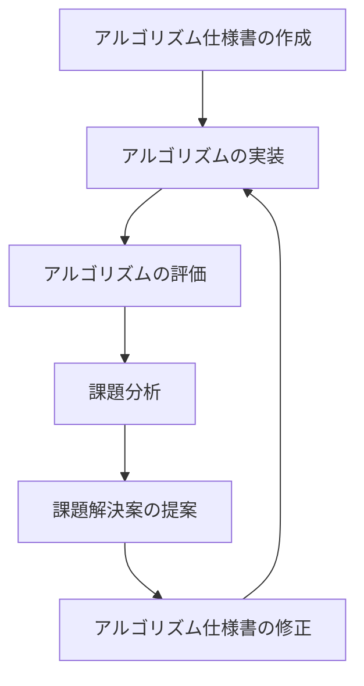

# 開発効率化プロジェクト
やりたいこと：
- アルゴリズム開発（仕様作成・実装）をAIを使って効率化できるかどうかを検討する。
- アルゴリズム仕様書とソースコードをセットでバージョン管理する
- ソースコードがpushされたら、自動で評価ツールを実行し集計する
- 評価ツールの結果をAIに分析させ、課題を見つける（pushから課題分析までを自動化したい。退勤前にpushしたら翌朝には課題分析結果が出るイメージ）
- 課題解決案をAIに提案させる
- AIが実施した課題分析は、jupyter notebookで実施させ、あとから人間が確認しやすいようにする

## サンプル環境の作成
サンプル環境として、連続閉眼を検出するアルゴリズムを開発しているとする。
- 両目を一定時間以上連続して閉眼した場合に、閉眼をルールベースで検出する。
- 閉眼の定義は、開眼度が設定値以下になった場合とする。

この機能のアルゴリズム開発をAIを使って効率化できるかどうかを検討する。

効率化要素案：
以下のループを回せるようになれば、効率化できる。

## 開発効率化プロジェクトの事前準備

### サンプルのコア機能のlogを作成

- 評価データセット撮影
    - タスク：1被験者あたり3s閉眼、2s開眼を5回繰り返す
    - 被験者数：4人
    - 動画は30fpsで撮影
- dlibを使って開眼度と信頼度を算出し、csvに保存
- 閉眼区間を示すタグの作成

### アルゴリズム仕様書のフォーマット・記載ルール作成
アルゴリズム仕様書のフォーマット・記載ルールを作成する。

### 実装ルールの作成
実装ルールを作成する。
- pythonで作成するが、C++でも作成することを考慮し、コメントを記載する。
- dlibを使って作成したcsvを読み込ませる場合と、別モジュールから呼び出せるようにするため、モジュール化する。

### 評価ツールの作成
アルゴリズムが出力した結果とタグを比較して正解率を算出するツールを作る。

## 仕込んでおく課題
(評価時、これらの課題をAIが自己解決できるかを確認。★は確実に見つけたい)
- アルゴリズム仕様と実装の不一致　★　→実装時に混入させる
- 設定値が不適切（閉眼の閾値など）　★　→実装時に混入させる
- 被験者のタスク不正　→データセットに混入させる

## 検討事項
- 課題分析する際に、AIに閉眼検知結果をすべて読み込ませるとコンテキストウィンドウが膨大になるため、解析方法に工夫が必要
- 動画を確認するしかない課題はどのように解析させるか

## 取得するデータセットの内容
生検知評価用データセット：
1. 被験者１：普通に５回閉眼
2. 被験者２：三回目だけ閉眼しない　→　被験者のタスク不正課題用
3. 被験者３：すべて完全に閉眼しない（キーボードを見る） →　config値の不適切課題用
4. 被験者４：目を遮蔽し、検出を不安定にする　→　動画を確認するしかない課題用

過検知評価用データセット：
2分普通にしているデータセット。
以下を含める
    - ウインク　→　片目だけ閉眼している状態で過検知を発生させ、分析させる
