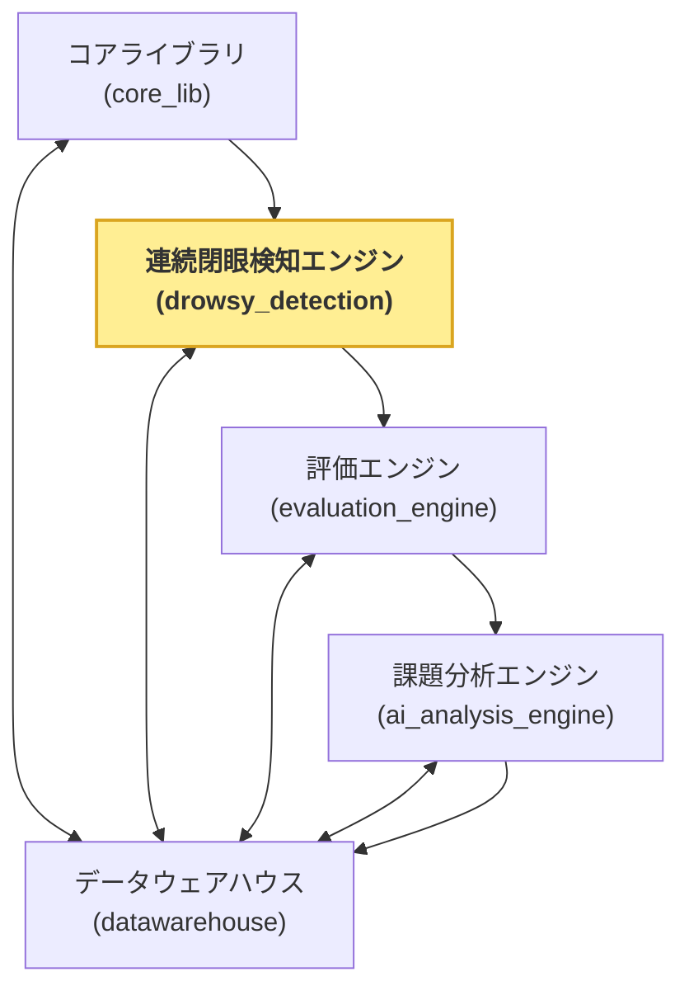

サンプルプロジェクトのシステム構成を以下に示します。

## 各エンジン

このシステムは以下のエンジンから構成されています。

### コアライブラリ(core_lib)

メインの連続運転検知エンジンの前段処理にあたるライブラリです。
ビデオ画像から特徴点を抽出し、開眼度と信頼度を算出します。

#### ポイント

- mediapipeを使用して、特徴点を抽出します。
- 特徴点から開眼度と信頼度を算出します。
- 開眼度と信頼度をcsvに保存します。

### 連続閉眼検知エンジン(drowsy_detection)

今回のサンプルプロジェクトのメインエンジンで、アルゴリズム開発の対象機能です。
この機能を開発するうえで、効率化できる仕組みを検討してきました。

#### ポイント

- pipでインストール可能なライブラリ構成
- github actionsで自動評価を行います。

## 評価エンジン(evaluation_engine)

連続閉眼検知エンジンの評価を行うエンジンです。
連続閉眼検知独自の評価仕様に従い、評価を行います。
現状は、正解率のみを評価しています。

#### ポイント

- drowsy_detectionをpush時、github actionsで呼び出され、評価を行います。
- 評価結果をdatawarehouseに登録します。

## 課題分析エンジン(ai_analysis_engine)

連続閉眼検知の課題を分析するエンジンです。
アルゴリズム仕様書、ソースコード、評価結果を入力とし、誤検出箇所の課題を分析します。

#### ポイント

- 連続閉眼検知のみではなく、汎用的に使用できるように、エージェントを構成しています。

## データウェアハウス(datawarehouse)

システム全体の入出力を管理するデータベースライブラリです。
現状はsqlite3を使用しています。

### ポイント

- 直接sqlを書く必要はなく、pythonのコードから操作できるよう、apiを提供しています。