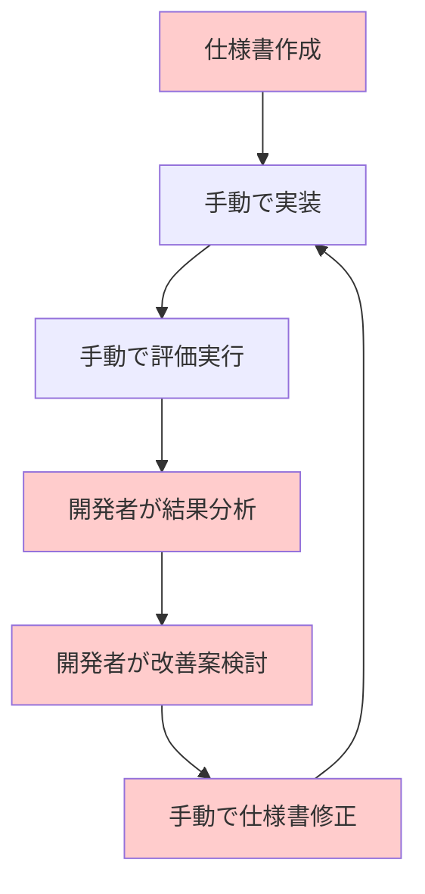
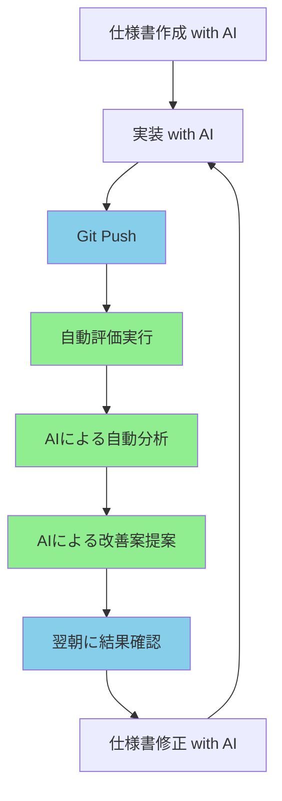
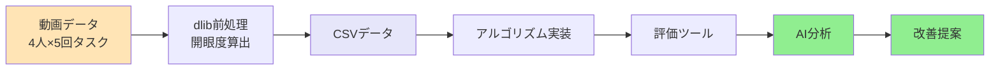
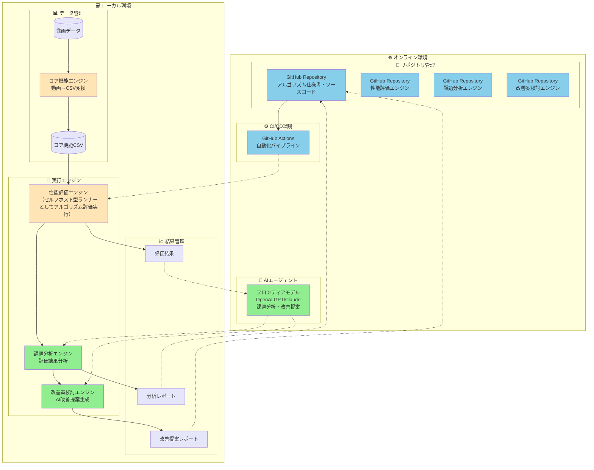

# アルゴリズム開発効率化プロジェクト提案書

## 📋 プロジェクト概要

### 目的
アルゴリズム開発プロセスをバージョン管理・CI/CD・AI技術を活用して自動化・効率化し、開発時間の短縮と品質向上を実現する。

> 現状（2025-08-20）: `drowsy_detection`（連続閉眼検知）と `core_lib`（OpenCV/MediaPipeベース）の実装が先行し、`DataWareHouse` と連携済みの設計・仕様が存在します。一方で、AI分析エンジン・課題管理・CI/CDは設計段階で実装は未着手のため、短期は既存実装の整合（uv手順、インポート統一、最小CI導入）を優先します。

### 背景
従来のアルゴリズム開発では、以下の課題が存在：
- 開発者が一人で仕様作成から実装、評価、改善までを手動で行う
- 開発者が退勤後は作業が停止する
- 仕様と実装が分離されており、差分がわかりにくい
- 評価結果の分析に時間がかかり、改善サイクルが長い
- 開発者の経験に依存する部分が多く、再現性に欠ける

## 🎯 解決したい課題

### 現在の開発フロー

### 課題点
- **時間的コスト**：分析・改善案検討に多くの時間を要する
- **人的依存**：開発者の経験・スキルに結果が左右される
- **再現性**：同じ課題でも分析結果が人によって異なる可能性
- **継続性**：開発者が退勤後は作業が停止する

## 🚀 提案する解決策

### AI活用による自動化フロー

### 自動化のポイント
1. **継続的評価**：コードがPushされると自動で評価実行
2. **AI分析**：評価結果をAIが自動分析し、課題を特定（Jupyter Notebook形式で出力）
3. **改善提案**：AIが具体的な改善案を提案
4. **課題管理**：AI分析結果から課題を自動生成、人間による優先度判断・対策対象選択
5. **効果測定**：修正前後の性能比較を自動実行
6. **非同期処理**：夜間処理により、翌朝には結果が準備完了
7. **可視化**：分析結果をJupyter Notebookで確認しやすく出力

## 📊 サンプルプロジェクト：閉眼検出アルゴリズム

### なぜ閉眼検出を選んだか
- **理解しやすい**：誰でもイメージできる機能
- **評価しやすい**：正解データの作成が容易
- **実用的**：実際の応用シーンが豊富
- **課題の多様性**：様々な改善ポイントが含まれる

### プロジェクト構成

### データ管理ポリシー
- データセットおよび各エンジン（コア/アルゴリズム/分析）の出力は、原則 `DataWareHouse/` 配下で一元管理します。
- 例:
  - 元データ: `DataWareHouse/01_mov_data/`
  - コア出力: `DataWareHouse/02_core_lib_output/v{core_semver}/{video_ID}/`
  - アルゴ出力: `DataWareHouse/03_algorithm_output/v{algo_semver}/{core_lib_output_ID}/`
- Notebook/HTML等のレポートも `DataWareHouse/` 配下に保存（CI/CDアーティファクトは別途）。

## 💰 期待される効果

### 定量的効果
| 項目 | 現在 | 提案後 | 改善率 |
|------|------|--------|--------|
| 分析時間 | 2-4時間/回 | 0時間（自動化） | **100%削減** |
| 改善サイクル | 1-2週間 | 1日 | **80%短縮** |
| 課題管理時間 | 1-2時間/回 | 0.5時間（人間判断のみ） | **75%削減** |
| 効果測定時間 | 2-3時間/回 | 0時間（自動化） | **100%削減** |
| 開発者工数 | 高スキル必須 | 初級者でも可能 | **スキル依存度削減** |

### 定性的効果
- **品質向上**：AIによる客観的な分析により、見落としを削減
- **学習効果**：AIの分析結果から開発者が学習
- **再現性**：同じ条件下では常に同じ分析結果
- **継続性**：24時間稼働可能な分析システム
- **可視性**：Jupyter Notebookによる分析結果の確認しやすさ
- **追跡性**：課題管理システムによる修正履歴の完全追跡
- **人間判断**：AI抽出課題から人間が優先度を判断し、対策対象を選択
- **効果測定**：修正前後の性能比較による改善効果の可視化

## 🏗️ 技術構成

### システム構成図

### 図形・線の凡例

#### 📊 図形の種類
- **[(データ)]**: データベース形 - データストレージ
- **[エンジン]**: 四角形 - 処理エンジン・システム
- **サブグラフ**: 環境・機能グループ

#### 🔗 線の種類
- **実線 →**: 直接的なデータフロー・処理フロー
- **点線 -.→**: 間接的な連携・API通信

#### 🎨 色の意味
- **青色 (#87CEEB)**: オンライン環境のリソース
- **緑色 (#90EE90)**: AI・分析関連
- **オレンジ色 (#FFE4B5)**: ローカル環境のエンジン
- **薄紫色 (#E6E6FA)**: データ・結果

### 使用技術

#### 🌐 オンライン環境
- **バージョン管理**：GitHub / GitLab
- **CI/CD**：GitHub Actions / GitLab CI
- **AI分析**：OpenAI GPT / Claude API
- **課題管理**：GitHub Issues / GitLab Issues
- **通知システム**：Slack / Email / Webhook

#### 💻 ローカル環境
- **データ処理**：Python + dlib + OpenCV
- **評価フレームワーク**：自社開発評価エンジン
- **分析可視化**：Jupyter Notebook + matplotlib + seaborn + plotly
- **データ管理**：CSV / JSON / 動画ファイル
- **コンテナ化**：Docker

### 詳細設計資料

各モジュールの詳細設計については、以下の資料を参照してください：

- **[AI分析エンジン設計書](詳細設計資料/AI分析エンジン設計書.md)**: Jupyter Notebook形式での分析レポート生成の詳細
- **[課題管理システム設計書](詳細設計資料/課題管理システム設計書.md)**: 課題の自動生成・管理・追跡システムの詳細
- **[CI/CDパイプライン設計書](詳細設計資料/CI_CDパイプライン設計書.md)**: 自動化パイプラインの詳細
- **[システムシーケンス図](詳細設計資料/システムシーケンス図.md)**: システム全体の処理フローを時系列で表現

## 📅 実施スケジュール

### Phase 1: 基盤構築（2025-08-05 〜 2025-08-16）
- プロジェクト構造の構築
- 評価データセットの作成
- 基本評価ツールの開発

**成果物**
- ディレクトリ構造設計書
- 4人×5回の評価データセット（動画・CSV）
- 基本評価ツール（Pythonスクリプト）
- Git submodules設定

### Phase 2: AI統合（2025-08-19 〜 2025-08-30）
- AI分析エンジンの開発（Jupyter Notebook形式での出力）
- 自動化パイプラインの構築
- 改善提案システムの実装
- 課題管理システムの構築

**成果物**
- AI分析エンジン（Jupyter Notebook）
- CI/CDパイプライン設定
- 改善提案システム（Pythonスクリプト）
- 課題管理システム（GitHub Issues連携）
- 自動化ワークフロー設定

### Phase 3: 検証実験（2025-09-02 〜 2025-09-06）
- サンプルアルゴリズムでの検証
- 課題発見精度の測定
- 改善提案の妥当性評価

**成果物**
- 検証実験レポート
- 課題発見精度測定結果
- 改善提案妥当性評価結果
- システム性能評価書

### Phase 4: 本格運用（2025-09-09 〜 2025-09-13）
- 他プロジェクトへの適用
- 運用ルールの確立
- ドキュメント整備

**成果物**
- 運用ルール・ガイドライン
- 技術ドキュメント一式
- 他プロジェクト適用事例
- 最終プロジェクトレポート

## 🎯 成功指標

### 主要KPI
1. **課題発見精度**：仕込んだ課題の90%以上を発見
2. **改善提案妥当性**：提案された改善案の70%以上が実装可能
3. **時間短縮効果**：分析時間の80%以上削減
4. **課題管理効率**：課題管理時間の75%削減（人間判断は維持）
5. **効果測定精度**：修正前後の性能比較精度95%以上
6. **開発者満足度**：システム利用者の80%以上が「有用」と評価

### 測定方法
- サンプルプロジェクトでの検証実験
- 実際の開発プロジェクトでの比較実験
- 開発者アンケート調査

## 💡 今後の展開

### 短期目標（2025年10月〜12月）
- 閉眼検出アルゴリズムでの検証完了
- 他アルゴリズム開発プロジェクトへの適用

### 中期目標（2026年1月〜6月）
- 複数プロジェクトでの並行運用
- AI分析精度の継続的改善
- 開発チーム全体への展開

### 長期目標（2026年7月〜12月）
- 社内標準ツールとして確立
- 他社への技術移転・ライセンス販売
- 新規AI機能の追加（コードレビュー、最適化提案等）

## 🔍 リスクと対策

### 主要リスク
| リスク | 影響度 | 対策 |
|--------|--------|------|
| AI分析精度不足 | 高 | 段階的改善、人間による検証 |
| システム障害 | 中 | 冗長化、バックアップ体制 |
| 開発者抵抗 | 中 | 段階的導入、教育・サポート |
| 個人情報漏洩 | 高 | データ分離、処理モジュールの分離、アクセス制御 |
| 修正対応付けの追跡困難 | 高 | 課題管理システム、コミットメッセージ規約、修正履歴管理 |

### 対策詳細
- **段階的導入**：小さなプロジェクトから開始
- **継続的改善**：フィードバックループの構築
- **教育・サポート**：開発者向け研修の実施
- **セキュリティ強化**：定期的なセキュリティ監査
- **分析結果の可視化**：Jupyter Notebookによる確認しやすい出力形式

### 課題管理・修正追跡システム

課題の自動生成・管理・修正追跡については、**[課題管理システム設計書](詳細設計資料/課題管理システム設計書.md)** を参照してください。

主な機能：
- AI分析結果からの課題自動生成
- 人間による優先度判断・対策対象選択
- コミットメッセージとの自動紐づけ
- 修正履歴の自動追跡
- 効果測定の自動実行

## 📞 まとめ

このプロジェクトにより、アルゴリズム開発の効率化と品質向上を実現し、開発チームの生産性を大幅に向上させることができます。AI技術を活用した自動化により、開発者は創造的な作業に集中でき、より価値の高い成果物を生み出すことが可能になります。

**投資対効果**：初期投資6週間で、継続的な開発効率化を実現
**スケーラビリティ**：他プロジェクトへの展開が容易
**競争優位性**：AI活用による開発効率化で他社との差別化

ご検討をお願いいたします。

---
**作成日**: 2025-07-25  
**最終更新**: 2025-07-25  
**バージョン**: 1.0 