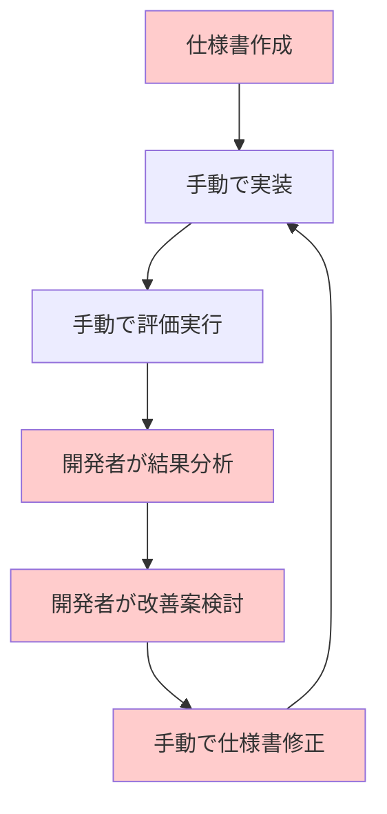
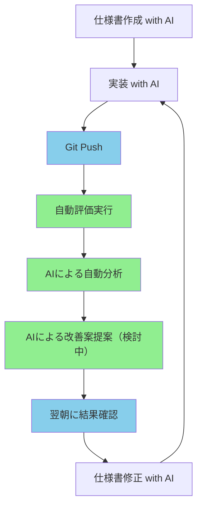
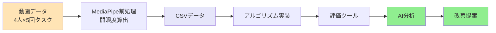
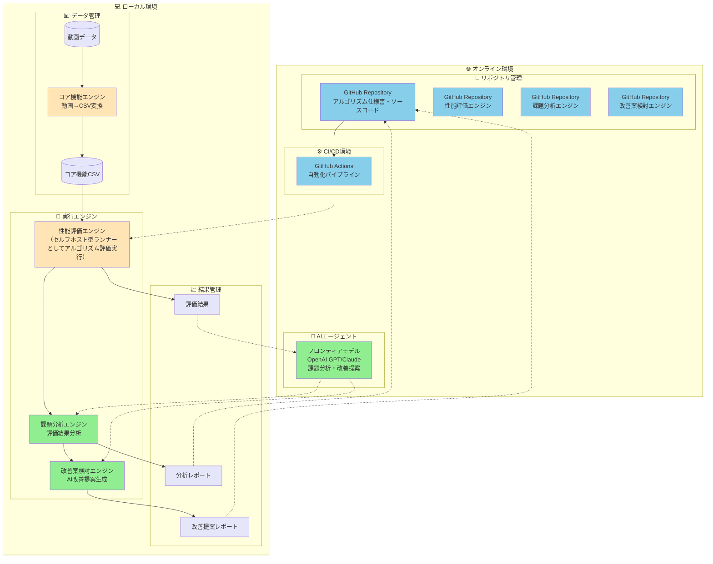

# アルゴリズム開発効率化プロジェクト提案書

## 📋 プロジェクト概要

### 目的

アルゴリズム開発プロセスをバージョン管理・CI/CD・AI技術を活用して自動化・効率化し、開発時間の短縮と品質向上を実現する。

### 背景

従来のアルゴリズム開発では、以下の課題が存在：

- 開発者が仕様作成から実装、評価、改善までを手動で行うことが多い
- 開発者が退勤後は作業が停止する
- 仕様と実装が分離されており、差分がわかりにくい
- 評価結果の分析に時間がかかり、改善サイクルが長い
- 開発者の経験に依存する部分が多く、再現性に欠ける

## 🎯 解決したい課題

### 現在の開発フロー

### 課題点
- **時間的コスト**：分析・改善案検討に多くの時間を要する
- **人的依存**：開発者の経験・スキルに結果が左右される
- **再現性**：同じ課題でも分析結果が人によって異なる可能性
- **継続性**：開発者が退勤後は作業が停止する

## 🚀 提案する解決策

### AI活用による自動化フロー

### 自動化のポイント

1. **継続的評価**：コードがPushされると自動で評価実行
2. **AI分析**：評価結果をAIが自動分析し、課題を特定
3. **ドキュメントとコードの一元管理**：ドキュメントとコードを一元管理することで、変更差分をわかりやすくする。

## 📊 サンプルプロジェクト：閉眼検出アルゴリズム

### なぜ閉眼検出を選んだか

- **理解しやすい**：誰でもイメージできる機能
- **評価しやすい**：正解データの作成が容易
- **実用的**：実際の応用シーンが豊富
- **課題の多様性**：様々な改善ポイントが含まれる

### プロジェクト構成

### データ管理ポリシー
- データセットおよび各エンジン（コア/アルゴリズム/分析）の出力は、原則データベースで一元管理します。
- 例:
  - 元データ: `DB/01_mov_data/`
  - コア出力: `DB/02_core_lib_output/v{core_semver}/{video_ID}/`
  - アルゴ出力: `DB/03_algorithm_output/v{algo_semver}/{core_lib_output_ID}/`
- AIによるレポートも DB 配下に保存。

## 💰 期待される効果

### 定量的効果
| 項目 | 現在 | 提案後 | 改善率 |
|------|------|--------|--------|
| 分析時間 | 5-8時間/回 | 1時間（半自動化） | **80%削減** |
| 効果測定時間 | 2-3時間/回 | 0時間（自動化） | **100%削減** |
| 開発者工数 | 高スキル必須 | 初級者でも可能 | **スキル依存度削減** |

### 定性的効果

- **品質向上**：AIによる客観的な分析により、見落としを削減
- **再現性**：同じ条件下では常に同じ分析結果
- **継続性**：24時間稼働可能な分析システム
- **追跡性**：課題管理システムによる修正履歴の完全追跡
- **効果測定**：修正前後の性能比較による改善効果の可視化

## 🏗️ 技術構成

### システム構成図【要修正】

### 使用技術

#### 🌐 オンライン環境
- **バージョン管理**：GitHub
- **CI/CD**：GitHub Actions
- **AI分析**：OpenAI API
- **課題管理**：(検討中)

#### 💻 ローカル環境
- **データ処理**：Python + MediaPipe + OpenCV
- **評価フレームワーク**：自社開発評価エンジン
- **データ管理**：CSV / sqlite / 動画ファイル

### 詳細設計資料【要修正】

各モジュールの詳細設計については、以下の資料を参照してください：

- **[AI分析エンジン設計書](詳細設計資料/AI分析エンジン設計書.md)**: Jupyter Notebook形式での分析レポート生成の詳細
- **[課題管理システム設計書](詳細設計資料/課題管理システム設計書.md)**: 課題の自動生成・管理・追跡システムの詳細
- **[CI/CDパイプライン設計書](詳細設計資料/CI_CDパイプライン設計書.md)**: 自動化パイプラインの詳細
- **[システムシーケンス図](詳細設計資料/システムシーケンス図.md)**: システム全体の処理フローを時系列で表現

## 🔍 リスクと対策

### 主要リスク
| リスク | 影響度 | 対策 |
|--------|--------|------|
| AI分析精度不足 | 高 | 段階的改善、人間による検証 |
| システム障害 | 中 | 冗長化、バックアップ体制 |
| 個人情報漏洩 | 高 | データ分離、処理モジュールの分離、アクセス制御 |
| 修正対応付けの追跡困難 | 高 | 課題管理システム、コミットメッセージ規約、修正履歴管理 |

主な機能：

- コーディング・仕様修正作業の負荷低減
- AI分析結果からの課題自動生成
- 人間による優先度判断・対策対象選択
- コミットメッセージとの自動紐づけ
- 修正履歴の自動追跡
- 効果測定の自動実行

## 📞 まとめ

このプロジェクトにより、アルゴリズム開発の効率化と品質向上を実現し、開発チームの生産性を大幅に向上させることができます。AI技術を活用した自動化により、開発者は創造的な作業に集中でき、より価値の高い成果物を生み出すことが可能になります。

## コスト

### 開発コスト

開発時間は、一日当たり1時間*15日*4ヶ月=60時間です。
また、開発にはcursorを使用しており、cursorの使用料は＄20/月のサブスク方式です。
育休を五ヵ月取得したため、ツール代として20*5=100$の開発費がかかっています。

### 運用コスト

コストが発生する主なフェーズとその時に発生したコストは以下の通りでした。

| フェーズ | コスト |
|----------|--------|
| 課題分析 | XX円/data @ OpenAI API使用|
| 改善提案生成 | XX円/data @ OpenAI API使用|

---
**作成日**: 2025-07-25  
**最終更新**: 2025-10-21  
**バージョン**: 2.0 