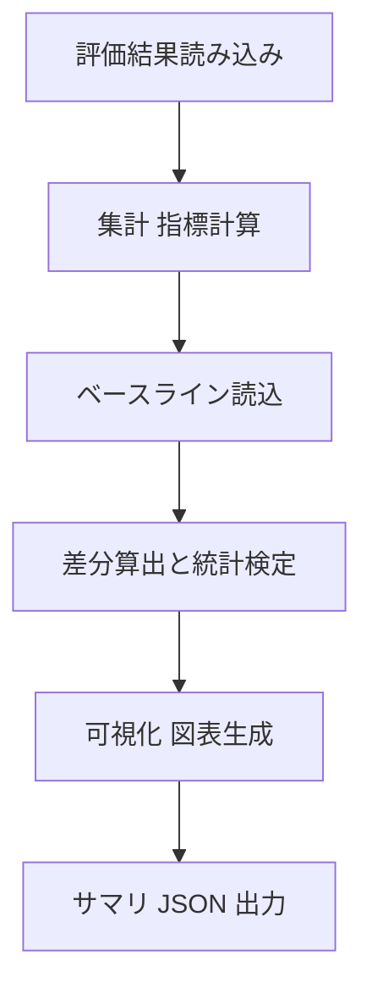

# 全体性能の確認・差分分析エージェント 仕様書（最新版）

この仕様書は、AI分析エンジンの「全体性能の確認・差分分析エージェント（パフォーマンスアナライザ）」の詳細仕様を示します。評価データセット全体の指標を集計し、前回実行やベースラインと比較して差分・トレンド・回帰の有無を判定し、図表を生成します。

---

## 目次
1. システム概要  
2. 処理の流れ  
3. 入力と出力  
4. 主要コンポーネント  
5. 機能の詳細  
6. システムの動かし方  
7. サンプルコード  
8. 初心者向け解説  
9. まとめ  
10. 開発ロードマップ

---

## 1. システム概要

### 1.1 目的
評価結果の集計、ベースライン比較、差分の可視化、統計的有意性の判定を自動化します。

### 1.2 指標
- Precision, Recall, F1-score, Accuracy
- 過検知率、未検知率、速度（ms/フレーム）、メモリ使用量
- クラス別/シーン別の指標、混同行列、ROC/PR

---

## 2. 処理の流れ



---

## 3. 入力と出力

### 3.1 入力
- 評価結果: CSV/Parquet/DB（予測、ラベル、スコア、時間、カテゴリ）
- ベースライン: 過去の集計 JSON または複数ランのフォルダ
- 設定: 指標の閾値、統計検定の手法、グラフのスタイル、集計粒度

### 3.2 出力
- 集計 JSON: `reports/data/analysis_summary.json`
- 差分 JSON: `reports/data/diff_summary.json`
- 図表: `reports/charts/`（時系列、混同行列、ROC/PR、誤差ヒートマップ、散布図）
- 回帰警告: 重大回帰のリストと根拠

---

## 4. 主要コンポーネント
- summary_metrics.py: 指標計算（マイクロ/マクロ/加重平均、クラス別）
- diff_analyzer.py: ベースライン比較、統計検定、回帰判定
- visualizations.py: 図表生成（matplotlib/plotly）
- exporter.py: JSON/PNG/HTML への出力

---

## 5. 機能の詳細

### 5.1 集計
- 欠損・外れ値処理、重複排除、時間整列
- 指標の集計（全体/クラス別/シーン別/時間窓）

### 5.2 差分と統計
- ベースラインとの差分、信頼区間、ブートストラップ
- t検定/比率検定/マクネマー検定（離散分類）
- 実務的有意性の基準（最小検出差）

### 5.3 可視化
- 時系列推移、混同行列、ROC/PR、誤差分布ヒートマップ、散布図
- ベースラインとの重ね描画、信頼区間の帯表示

### 5.4 回帰判定とアラート
- 閾値超過や有意な悪化を回帰として自動判定
- 重大回帰は優先度を上げてレポート

---

## 6. システムの動かし方
1. 入力データとベースラインを指定
2. 指標と検定の設定を調整
3. 実行して `reports/` の成果物を確認

---

## 7. サンプルコード
```python
from ai_analysis_engine.performance_analyzer import analyze_performance

summary, diff, figs = analyze_performance(
    predictions_path="datasets/predictions.csv",
    labels_path="datasets/labels.csv",
    baseline_json="reports/data/prev_summary.json",
    metrics=["precision", "recall", "f1", "accuracy"],
    test_methods=["bootstrap", "t_test"],
)
```

---

## 8. 初心者向け解説
- 全体の成績表を作って、前回と比べて良くなったか悪くなったかをグラフで示します。

---

## 9. まとめ
集計・差分・統計・可視化を自動化し、回帰検知と根拠提示まで一気通貫で行います。

---

## 10. 開発ロードマップ
1. 指標計算と検定のユニットテスト
2. ベースライン管理とラン比較の強化
3. 可視化テンプレートの整備
4. 回帰アラートのしきい値最適化
5. 大規模データの高速化


