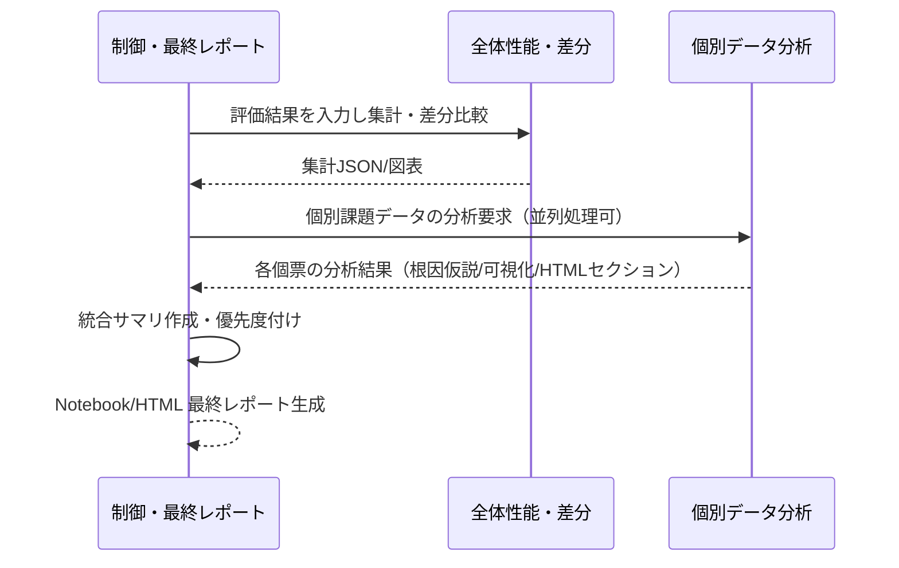
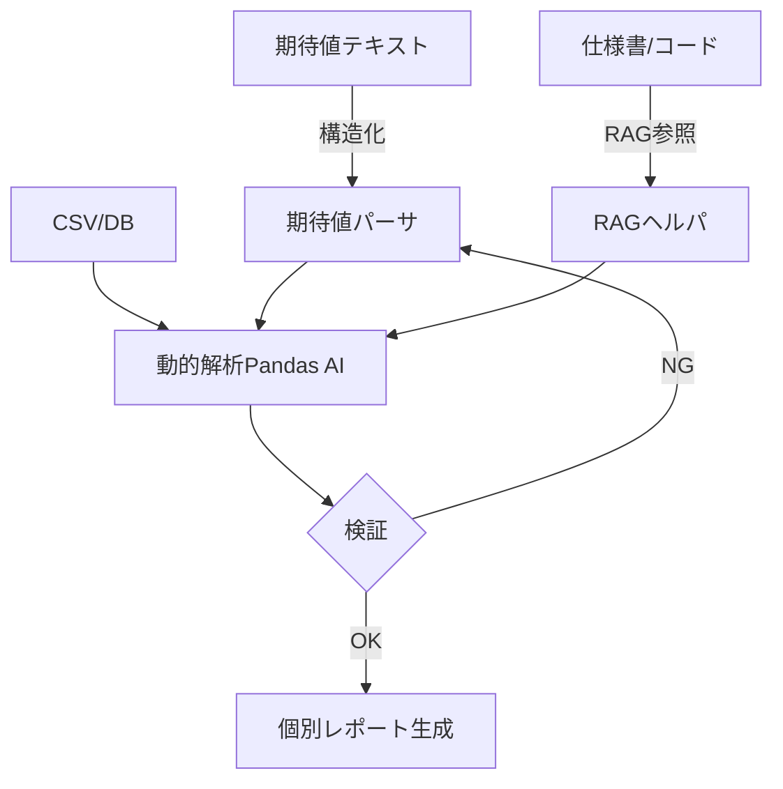

# AI分析エンジン設計書

> 現状（2025-08-20）: 本仕様に対応する実装は未着手です。実装は`uv`管理の別モジュールとして提供予定で、現行リポジトリでは `drowsy_detection`・`core_lib`・`DataWareHouse` の連携整備を優先しています。

## 📋 概要

AI分析エンジンは、アルゴリズム評価結果を自動分析し、Jupyter Notebook形式で分析レポートを生成するシステムです。

本エンジンは次の3つのエージェントの組み合わせで構成されます。

1. 制御・最終レポートエージェント（オーケストレータ）
   - エージェント2/3を統括し、実行順序・入出力・失敗時リトライ・要約を管理
   - 最終的な統合レポート（Notebook/HTML）の生成・体裁調整・確認

2. 全体性能の確認・差分分析エージェント（パフォーマンスアナライザ）
   - 評価データセット全体の正解率・過検知率・未検知率・速度などを集計
   - 前回実行やベースラインとの比較（差分）を可視化し、傾向・回帰の有無を判定

3. 個別データの分析エージェント（インスタンスアナライザ）
   - 課題データ（個票）ごとの詳細分析を実施
   - 仕様書・ソースコード・期待値を参照しつつ、仮説→検証→ループバックで原因特定を支援

## 🎯 機能要件

### 主要機能
1. **自動評価結果分析**
2. **Jupyter Notebook形式でのレポート生成**
3. **改善提案の自動生成**
4. **課題の優先度付け**
5. **全体性能差分レポート**（エージェント2）
6. **個別データ詳細レポート**（エージェント3）

### レポート構成
1. **サマリセクション**
   - 全体評価スコア（Precision, Recall, F1-score）
   - 主要課題の要約（上位3-5件）
   - 改善優先度ランキング
   - 推奨アクション

2. **個別分析結果**
   - 時系列分析
   - エラー分析
   - パフォーマンス分析
   - ロバスト性分析

3. **詳細分析**
   - データ品質分析
   - アルゴリズム特性分析
   - エッジケース分析
   - 比較分析

4. **可視化セクション**
   - 時系列グラフ
   - 混同行列
   - ROC曲線・PR曲線
   - エラー分布ヒートマップ
   - パフォーマンス散布図

5. **改善提案セクション**
   - 即座に実施可能
   - 短期改善
   - 中期改善
   - 長期改善

## 🏗️ 技術仕様

### 使用技術
- **AI API**: OpenAI GPT / Claude
- **データ処理**: Python + pandas + numpy
- **可視化**: matplotlib + seaborn + plotly
- **レポート形式**: Jupyter Notebook (.ipynb)
- **コンテナ化**: Docker

（拡張: 個別分析で使用）
- **エージェント実装**: LangChain など
- **RAG**: FAISS ベクトルストア等
- **コード解析**: AST解析
- **動的解析**: Pandas AI
- **HTMLレポート**: Jinja2 + Plotly（Notebookと併用可）

### システム構成
```
AI分析エンジン/
├── controller/                          # 1. 制御・最終レポートエージェント
│   ├── orchestrator.py                  # 実行順序・入出力連携・失敗時リトライ
│   ├── final_report.py                  # 最終Notebook/HTML生成
│   └── templates/
│       ├── notebook_template.ipynb
│       └── html_template.html
├── performance_analyzer/                # 2. 全体性能の確認・差分分析
│   ├── summary_metrics.py               # Precision/Recall/F1/過検知/未検知/速度
│   ├── diff_analyzer.py                 # 前回/ベースライン比較
│   ├── visualizations.py                # 混同行列・PR/ROC・トレンド
│   └── exporter.py                      # JSON/PNG/HTML などの成果物出力
├── instance_analyzer/                   # 3. 個別データの分析
│   ├── expectation_parser.py            # 期待値の構造化（テンプレ＋LLM）
│   ├── rag_helper.py                    # 仕様書/コード参照（FAISS）
│   ├── dynamic_analysis.py              # Pandas AI による動的解析
│   ├── hypothesis_loop.py               # 仮説→検証→ループバック
│   ├── code_inspector.py                # ASTベースのコード確認
│   └── instance_report.py               # 個別レポート生成（HTML/Notebookセクション）
└── shared/
    ├── io_schemas.py                    # 入出力スキーマ（pydantic）
    ├── utils.py                         # 共通ユーティリティ
    └── plot_styles.py                   # 可視化スタイル
```

## 📊 分析項目詳細

### 時系列分析
- フレーム単位での精度変動
- 時間帯別の性能変化
- 継続性の評価

### エラー分析
- 誤検知・未検知の詳細分析
- エラーパターンの分類
- エラー原因の特定

### パフォーマンス分析
- 処理速度の測定
- メモリ使用量の監視
- リソース効率の評価

### ロバスト性分析
- 異なる条件での動作安定性
- ノイズ耐性の評価
- 環境変化への適応性

## 🔄 処理フロー

1. **評価結果データ読み込み**
2. **基本統計量の算出**
3. **全体性能の確認・差分分析（エージェント2）**
4. **個別データの詳細分析（エージェント3）**
5. **可視化データ・中間レポート生成**
6. **改善提案の生成**
7. **最終レポート統合出力（エージェント1）**



---

## 3. 個別データの分析エージェント（詳細仕様）

本章の詳細仕様はボリュームが大きいため、専用ドキュメントに分離しました。Notebook出力を基本としつつ、HTMLレポート生成にも対応します。

- 参照: `projects/詳細設計資料/AI分析エンジン/個別データ分析エージェント仕様.md`
 - 参照: `projects/詳細設計資料/AI分析エンジン/制御・最終レポートエージェント仕様.md`
 - 参照: `projects/詳細設計資料/AI分析エンジン/全体性能差分分析エージェント仕様.md`

### 3.1 目的と特徴
- 自然言語の期待値・仕様書・ソースコードを参照し、個票データの異常箇所を特定
- 仮説→検証→ループバックの自律サイクルで原因特定を支援（最大試行回数を設定）
- 解析は Pandas AI を用いた動的コード生成で実施し、根拠を出力

### 3.2 入力
- データ: CSV または DB（例: `frame`, `value`, `category` など）
- 仕様書: Markdown（アルゴリズム仕様）
- ソースコード: Python 等（必要に応じて AST 解析）
- 期待値: 自然言語（テンプレート＋LLM で構造化 JSON に変換）

### 3.3 出力
- 個別レポート（HTML セクション or Notebook セル）
  - 異常箇所（場所・検出値・期待値・差分）
  - 仮説（例: 条件分岐ミス、パラメータ不整合、データ不備）
  - 可視化（Plotly 対応のグラフ/表）
  - 初心者向けサマリ（自然言語）

### 3.4 処理の流れ


### 3.5 主要コンポーネント
- 期待値パーサ: 正規表現テンプレート＋LLM フォールバックで JSON 構造化
- RAG ヘルパ: 仕様書・コードを FAISS 等で検索し、根拠文脈を抽出
- 動的解析: Pandas AI で適切な列/指標/範囲を選択しコード生成・実行
- 検証/ループバック: 検証失敗時は最大 N 回まで仮説再生成
- レポート生成: Plotly 図/表とともに HTML セクションを生成（Notebookへ埋込可）

### 3.6 入出力例（抜粋）
- 課題（期待値）: 入力「フレーム x~y は項目 z が w であるべき」
- エージェントの動作:
  1. 結果の確認: 仕様書・ソースコードから入力内容が本当に正しいかを状況確認（項目 z の定義、期待値 w の意味/単位、前処理の有無などを確認）
  2. 仮説検討のためのデータ収集: 仕様書・ソースコードからアルゴリズムの入力としているデータを特定し、アクセスして課題シーンの入力値を抽出。フレーム数が多い場合は z の時系列プロットや z と出力の対応関係などの図表を生成して確認
  3. 仮説の検討: 課題シーンにおいて input に対する output の状態を照合し、仕様通りであれば 4. で input の詳細解析を実施。仕様外の動作をしている場合は 4. で仕様・ソースコードを詳細分析
  4. 仮説が正しいかを検証: 3. で確認した状態に応じて詳細解析（仕様書には具体例を数件明記。例: 閾値の境界条件、NaN/欠損時処理、座標系変換の取り扱いなど）
  5. 出力: 仮説が正しい場合は課題として出力。仮説が間違っている場合は 2. に戻り再検討（最大試行回数まで）

- 出力（レポートセクション例）:
  - 異常: フレーム x~y, 項目 z, 実測値の範囲/代表値, 期待 w, 差分または逸脱率
  - 仮説: 前処理順序の問題、閾値設定ミス、データ供給遅延/同期ずれ、境界条件の実装抜け 等
  - 図: z の時系列プロット、出力との相関図、該当区間のハイライト（Plotly）

### 3.7 設定
- 最大ループ回数、LLM モデル、RAG トップK、Pandas AI 実行タイムアウト、出力形式（Notebook/HTML）等

---

## 📈 出力例

### レポートファイル構成
```
reports/
├── analysis_report_YYYYMMDD_HHMMSS.ipynb
├── charts/
│   ├── time_series.png
│   ├── confusion_matrix.png
│   ├── roc_curve.png
│   └── error_heatmap.png
└── data/
    ├── analysis_summary.json
    └── improvement_suggestions.json
```

### サンプルコード例
```python
# 分析エンジンの実行例
from ai_analysis_engine import AIAnalysisEngine

# エンジンの初期化
engine = AIAnalysisEngine(
    model_name="gpt-4",
    evaluation_data_path="evaluation_results.csv",
    output_dir="analysis_reports"
)

# 分析実行
report = engine.analyze(
    algorithm_name="eye_detection_v1",
    evaluation_metrics=["accuracy", "speed", "robustness"],
    comparison_baseline="eye_detection_v0"
)

# レポート生成
report.generate_summary()
report.generate_detailed_analysis()
report.generate_improvement_suggestions()
```

### 出力サンプル
```markdown
# 分析サマリー

## 実行概要
- **分析日時**: 2025-07-25 14:30:00
- **対象アルゴリズム**: eye_detection_v1
- **評価回数**: 20回（4人×5回）
- **比較対象**: eye_detection_v0

## 主要結果
- **精度**: 85.2% (前回比 +5.3%)
- **処理速度**: 平均 120ms (前回比 -15ms)
- **検出率**: 92.1% (前回比 +3.2%)

## 改善提案
1. **パフォーマンス最適化**: 処理速度をさらに20%向上可能
2. **エラーハンドリング強化**: エッジケースの対応改善
3. **メモリ使用量削減**: 現在の80%まで削減可能
```

## 🔧 設定項目

### AI分析パラメータ
- 分析深度レベル（Basic/Standard/Detailed）
- 改善提案の数（デフォルト：10件）
- 可視化の詳細度
- レポートの出力形式

### カスタマイズ項目
- 分析項目の追加・削除
- 可視化チャートのカスタマイズ
- 改善提案の優先度計算方法
- レポートテンプレートの変更

## 📝 更新履歴

- **2025-07-25**: 初版作成（v1.0）
- **2025-08-08**: 3エージェント構成を定義し、個別データ分析エージェントの詳細仕様を統合（v1.1）
- **2025-08-17**: 3.6 入出力例を「フレーム x~y は項目 z が w であるべき」に基づく現実的ワークフローへ更新（v1.2）