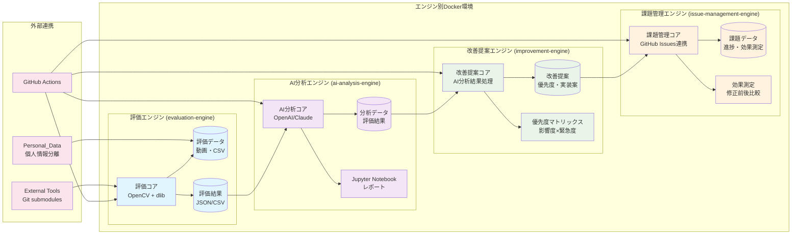
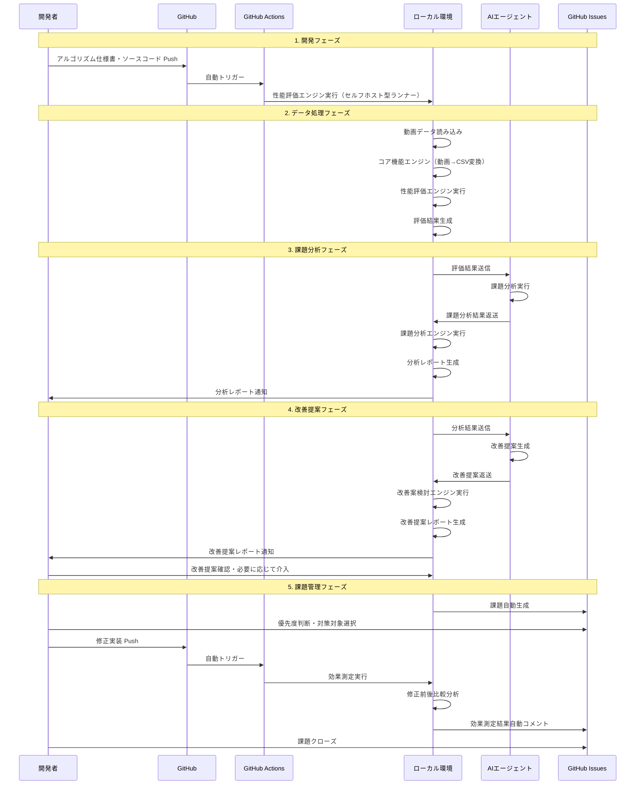
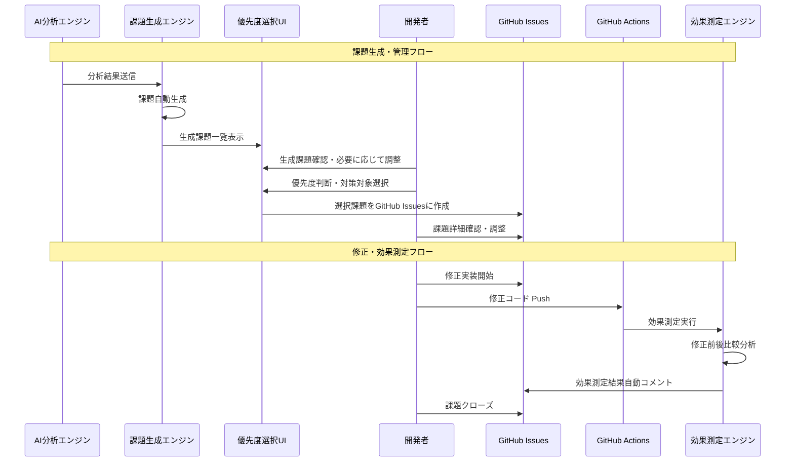
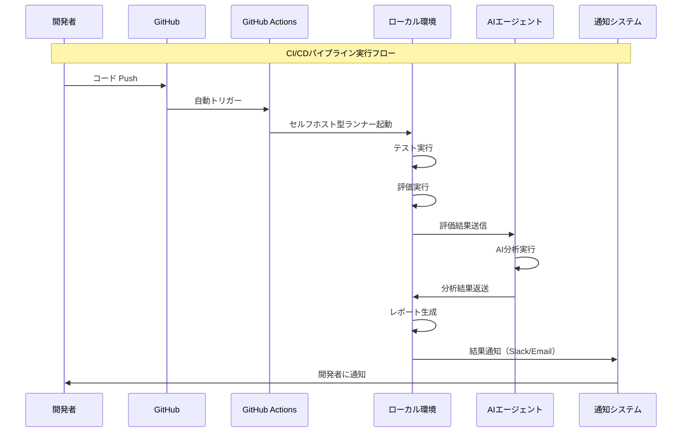
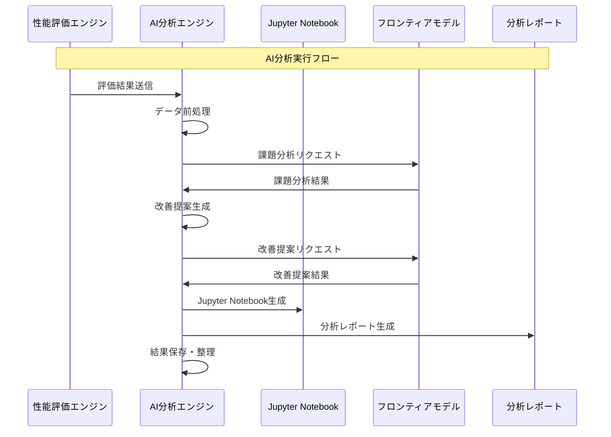
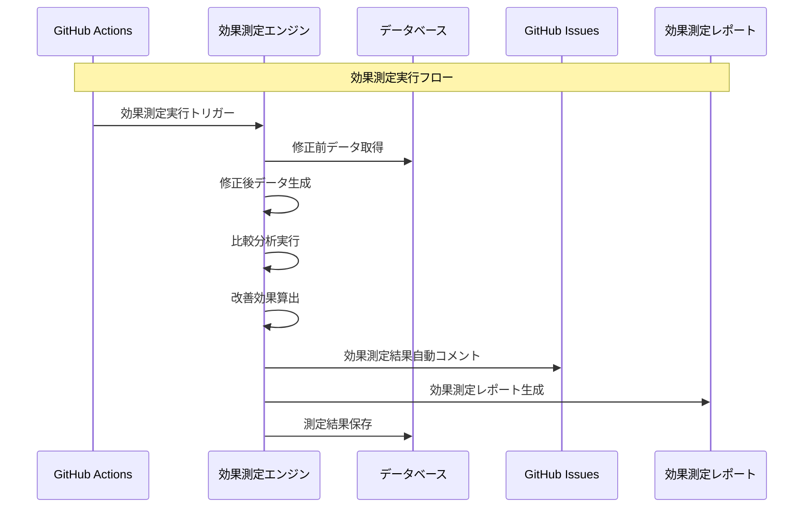

# システムシーケンス図

## 📋 概要

アルゴリズム開発効率化システムの主要な処理フローを時系列で表現したシーケンス図です。

## 🏗️ システム全体構成図

### アルゴリズム開発エンジン環境の詳細構成

## 🔄 メインシーケンス：アルゴリズム開発・評価・改善サイクル

## 🔄 詳細シーケンス：課題管理システム

## 🔄 詳細シーケンス：CI/CDパイプライン

## 🔄 詳細シーケンス：AI分析エンジン

## 🔄 詳細シーケンス：効果測定システム

## 📊 シーケンス図の凡例

### 参加者（Actor）
- **開発者**: 人間の開発者
- **GitHub**: オンライン環境のリポジトリ管理
- **GitHub Actions**: CI/CDパイプライン
- **ローカル環境**: ローカル環境の実行エンジン群
- **AIエージェント**: フロンティアモデル（OpenAI GPT/Claude）
- **GitHub Issues**: 課題管理システム

### メッセージの種類
- **実線矢印**: 同期通信（即座に応答）
- **点線矢印**: 非同期通信（応答を待たない）
- **Note**: 処理フェーズの説明

### 処理タイミング
- **即座処理**: 開発者のアクションに応じて即座に実行
- **夜間処理**: 開発者退勤後の自動実行
- **翌朝確認**: 夜間処理完了後の結果確認

### 処理フェーズ
1. **開発フェーズ**: コードのPushから評価実行まで
2. **データ処理フェーズ**: 動画データの処理から評価結果生成まで
3. **AI分析フェーズ**: AIによる課題分析と改善提案生成
4. **課題管理フェーズ**: 課題の生成から管理まで
5. **効果測定フェーズ**: 修正前後の比較分析

## 🎯 シーケンス図の特徴

### 自動化ポイント
- **継続的評価**: コードPushで自動トリガー
- **AI分析**: 評価結果の自動分析
- **課題生成**: AI分析結果からの自動課題生成
- **効果測定**: 修正前後の自動比較分析

### 人間介入ポイント
- **改善提案確認**: 改善提案レポートの確認・必要に応じて介入
- **生成課題確認**: AI生成課題の確認・必要に応じて調整
- **優先度判断**: 抽出された課題の優先度判断
- **対策対象選択**: どの課題を対策対象とするかの選択
- **修正実装**: 実際のコード修正
- **課題クローズ**: 効果測定後の課題完了判断

### 非同期処理
- **夜間処理**: 開発者が退勤後の自動処理
- **翌朝確認**: 翌朝に結果を確認する仕組み
- **通知システム**: 処理完了時の自動通知
- **自動処理**: 評価・分析までは自動で処理を継続

---
**作成日**: 2024-07-25  
**最終更新**: 2024-07-25  
**バージョン**: 1.0 