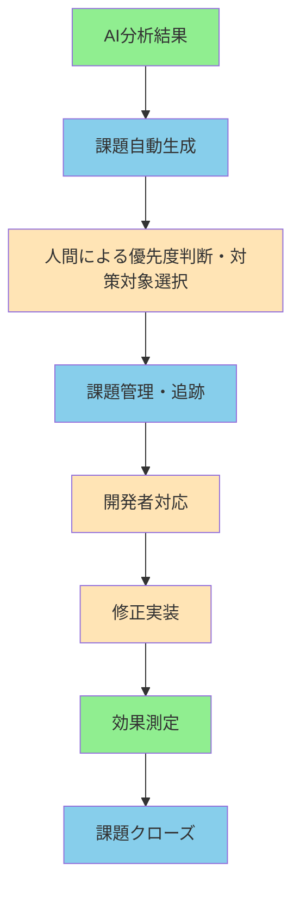
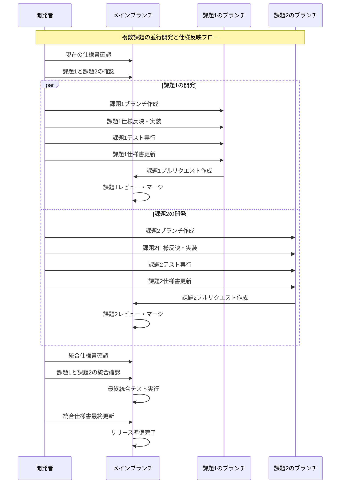

# 課題管理システム設計書

## 📋 概要

課題管理システムは、AI分析結果から生成された改善提案を自動生成し、人間による優先度判断・対策対象選択を経て、修正履歴を追跡するシステムです。

## 🎯 機能要件

### 主要機能
1. **課題の自動生成**
2. **人間による優先度判断・対策対象選択**
3. **課題管理・追跡**
4. **修正履歴の追跡**
5. **コミットメッセージとの自動紐づけ**
6. **効果測定の自動実行**

### 課題管理フロー


### 複数課題のアルゴリズム仕様反映手順シーケンス図

### 運用ルール例
- **優先度判断**: 高（即座対応）、中（次回リリース）、低（将来対応）
- **対策対象選択**: 影響度×緊急度マトリックスで判断
- **効果測定**: 修正前後の性能比較を自動実行
- **課題クローズ**: 効果測定完了後、改善確認後にクローズ

## 🏗️ システム構成

### 使用技術
- **課題管理**: GitHub Issues / GitLab Issues
- **バージョン管理**: Git
- **CI/CD**: GitHub Actions / GitLab CI
- **自動化**: Pythonスクリプト
- **AI連携**: OpenAI GPT / Claude API
- **効果測定**: 自動性能比較システム

### システム構成図
```
課題管理システム/
├── issue_generator.py     # 課題自動生成
├── priority_selector.py   # 優先度判断・対策対象選択UI
├── commit_tracker.py      # コミット追跡
├── effect_measurement.py  # 効果測定
├── report_generator.py    # レポート生成
└── config/
    ├── issue_templates/   # 課題テンプレート
    ├── priority_rules.py  # 優先度判断ルール
    └── commit_rules.py    # コミット規約
```

## 📝 課題管理仕様

### 課題ID体系
- **形式**: `ISSUE-XXX`（XXXは連番）
- **例**: `ISSUE-001`, `ISSUE-002`

### 課題ステータス
1. **Open**: 新規作成
2. **In Progress**: 対応中
3. **Review**: レビュー中
4. **Closed**: 完了

### 課題テンプレート
```markdown
## 課題概要
- **課題ID**: ISSUE-XXX
- **優先度**: High/Medium/Low
- **カテゴリ**: Performance/Accuracy/Error/Feature
- **推定工数**: X時間

## 詳細
[AI分析結果からの詳細説明]

## 改善提案
[具体的な改善案]

## 期待効果
[修正後の期待される改善]

## 関連データ
- 評価結果ファイル: [ファイルパス]
- 分析レポート: [レポートパス]
```

## 🔄 コミットメッセージ規約

### 基本形式
```
[ISSUE-XXX] 修正内容の概要

詳細な修正内容（必要に応じて）
```

### 複数課題の同時修正
```
[ISSUE-001][ISSUE-003] パフォーマンス改善とエラーハンドリング強化

- ISSUE-001: 処理速度30%向上
- ISSUE-003: エラーハンドリング強化
```

### コミットタイプ
- `[FIX]`: バグ修正
- `[FEATURE]`: 新機能追加
- `[REFACTOR]`: リファクタリング
- `[PERFORMANCE]`: パフォーマンス改善
- `[DOCS]`: ドキュメント更新

## 🌿 ブランチ戦略

### ブランチ命名規則
```
{type}/ISSUE-{ID}-{description}
```

### ブランチタイプ
- `fix/`: バグ修正
- `feature/`: 新機能
- `refactor/`: リファクタリング
- `performance/`: パフォーマンス改善

### 具体例
```
fix/ISSUE-001-performance-improvement
feature/ISSUE-002-new-algorithm
refactor/ISSUE-003-code-optimization
```

## 📊 効果測定システム

### 測定項目
1. **性能指標**
   - Precision, Recall, F1-score
   - 処理速度
   - メモリ使用量

2. **品質指標**
   - エラー率
   - 安定性
   - ロバスト性

### 測定タイミング
- **修正前**: ベースライン測定
- **修正後**: 効果測定
- **比較分析**: 改善効果の算出

### 自動測定フロー
```
1. プルリクエスト作成
2. CI/CDパイプライン実行
3. 自動テスト・評価実行
4. 修正前後の比較分析
5. 結果を課題に自動コメント
6. 効果測定レポート生成
```

## 🔧 自動化機能

### 課題自動生成
- AI分析結果から課題を自動生成
- 優先度の初期設定（人間による調整が必要）
- カテゴリの自動分類

### 人間による優先度判断・対策対象選択
- 抽出された課題の優先度を人間が判断
- 対策対象とする課題を人間が選択
- 優先度判断の理由を記録
- 対策対象外とする課題の理由を記録

### コミット追跡
- コミットメッセージから課題IDを自動抽出
- 課題ステータスの自動更新
- Git履歴の自動リンク

### 効果測定
- 修正前後の性能比較を自動実行
- 改善効果の自動算出
- レポートの自動生成

## 📈 レポート機能

### 課題管理レポート
- 課題の進捗状況
- 修正効果の統計
- 開発者の生産性分析

### 効果測定レポート
- 修正前後の性能比較
- 改善効果の可視化
- トレンド分析

## 🔒 セキュリティ・アクセス制御

### アクセス権限
- **開発者**: 課題の閲覧・更新
- **リーダー**: 課題の管理・削除
- **管理者**: システム設定・ユーザー管理

### データ保護
- 個人情報の分離
- アクセスログの記録
- 定期的なセキュリティ監査

## 📝 運用ルール

### 課題作成ルール
1. AI分析結果から自動生成
2. 手動での追加・修正も可能
3. 重複課題の自動検出

### 修正対応ルール
1. 1課題1ブランチ原則
2. プルリクエストでのレビュー必須
3. 効果測定の自動実行

### クローズルール
1. 修正の完了確認
2. 効果測定の合格
3. レビューの承認

## 📝 更新履歴

- **2025-07-25**: 初版作成
- **バージョン**: 1.0 